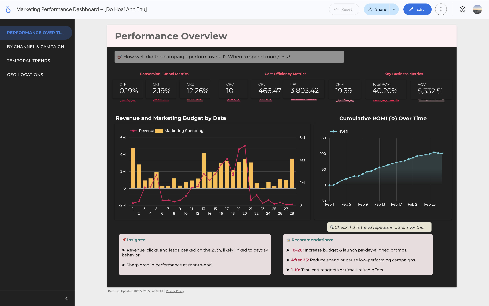
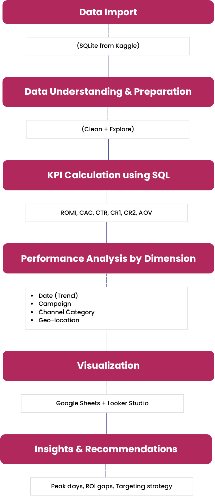

## 📊 Interactive Dashboard

This project also includes an **interactive dashboard** for exploring stock data.  
You can preview it below and click the link to interact with the live version.

  

🔗 [View Interactive Dashboard on Looker Studio](https://lookerstudio.google.com/reporting/1b4800d6-9a61-41de-9114-380f1dc8de7a)  

---

## About Dataset  
This dataset captures **key performance data** from a simulated marketing campaign, including spend, customer behavior, and business outcomes.  
- Each row represents a campaign on a specific date, with attributes such as impressions, clicks, leads, orders, and revenue.  
- **Source**: Kaggle  
- **Size**: 300 rows, 10 columns  
- **Main columns**: Date, Campaign Name, Category, Impressions, Clicks, Leads, Orders, Revenue, Marketing Spent  

The dataset enables analysis of important marketing KPIs, including:  
- **ROMI (Return on Marketing Investment)**  
- **CPC (Cost per Click)**  
- **CPL (Cost per Lead)**  
- **CAC (Customer Acquisition Cost)**  
- **AOV (Average Order Value)**  
- **CR (Conversion Rates)**  

---

## Business Questions  

1. **Marketing ROI & Efficiency**  
   - What is the overall ROMI?  
   - ROMI by campaigns
 → Which campaigns deliver the best return relative to spend?  

2. **Campaign Performance Over Time**  
   - Performance by date
 → When did we spend the most?  
 → When did we earn the most revenue?  
 → Analyze peak conversion rates and average order value.  

3. **Customer Behavior Analysis**  
   - When are buyers more active?  
 → Compare average revenue on weekdays vs weekends.  

4. **Campaign Type Effectiveness**  
   - Which campaign types work best (Social, Banner, Influencer, Search)?  

5. **Geo-targeting Strategy**  
   - Which geo-locations perform better: Tier 1 vs Tier 2 cities?  

---

## Methodology  

**Tools Used**  
- **DB Browser for SQLite**: Querying and manipulating the dataset using SQL.  
- **Google Sheets**: Visualizing results with bar charts, line charts, and comparison tables.  
- **Looker Studio**: Building an interactive dashboard for dynamic performance monitoring and insights discovery.  

**Workflow**  
1. Imported dataset directly into SQLite (no preprocessing needed).  
2. Wrote SQL queries to answer 5 key business questions about marketing performance.  
3. Exported query results into Google Sheets for visualization.  
4. Built **20+ visualizations** to analyze performance by campaign category, city tier, and day of week.  

**Key Metrics Calculated**  
- **ROMI** = Return on Marketing Investment → effectiveness of spend.  
- **CTR** = Click-through rate (Clicks / Impressions).  
- **CR1** = Visitor → Lead conversion rate (Leads / Clicks).  
- **CR2** = Lead → Order conversion rate (Orders / Leads).  
- **CPC** = Cost per Click (Marketing Spend / Clicks).  
- **CPL** = Cost per Lead (Marketing Spend / Leads).  
- **CAC** = Customer Acquisition Cost (Marketing Spend / Orders).  
- **AOV** = Average Order Value (Revenue / Orders).  
- **Gross Profit** = Revenue – Marketing Spend.  

These metrics were computed at multiple aggregation levels: **by campaign, by category, by city tier, and by weekday vs weekend** → enabling a comprehensive evaluation of marketing performance. 

# Marketing Campaign Analysis

## Workflow  

---

## Performance Over Time  

### Business Question: *When did we spend or earn the most?*

**Key Insights**  
- **Clicks** increased steadily from the 10th to the 20th, peaking on the 20th, before dropping sharply at the end of the month.  
- **CPC** was most efficient between the 18th and 20th → optimal cost-performance period.  
- **Leads** followed a similar trend, peaking on the 20th, then declining sharply.  
- **CPL** remained suboptimal → conversion optimization opportunities.  

  

---

### Revenue Trends by Date  

**Business Question: *When did we spend or earn the most?***  

**Key Insights**  
- **Revenue** peaked on the 20th, aligning with **clicks** and **leads**, before dropping at month-end.  
- **ROMI** decreased sharply at the end of the month → high spend but low conversion value.  
- Mid-month surge may correlate with consumer payday behavior → higher engagement and purchases.  

---

## Performance by Campaign  

### Conversion Efficiency & CTR Patterns  

**Key Insights**  
- **Facebook Retargeting** → highest CR2 (21.34%) despite moderate CTR (3.07%) → strong lead nurturing.  
- **Facebook Tier 2** → highest CTR (2.55%) but very poor CR2 (8.16%) → wrong audience segment.  
- **Banner Partner** → lowest CTR (0.04%) → poor creative or placement.  
- **Facebook Tier 1** → poor CR2 (13.41%) despite high-quality audience → issue with audience definition/relevance.  
- **Instagram Tier 2** → lowest CR2 (3.02%) → content mismatch with mid-value segment.  

---

### Business Question: *Which campaign types deliver the best ROI?*  

**Key Insights**  
- **YouTube Blogger** → top-performing (ROMI: 277.32) → strong influencer effect.  
- **Facebook Retargeting (ROMI: 101.5)** and **Google Hot (ROMI: 83.8)** also high returns.  
- **Instagram Tier 2** and **Facebook LAL** → negative ROMI despite high spend → inefficient targeting.  

---

### Campaign Efficiency Insight: *High Spend ≠ High Return*  

**Key Insights**  
- **Facebook LAL** → highest CAC (8,986), low CR2 (15.4%) → inefficient budget usage.  
- **Facebook Tier 2** → high CAC (6,822), low conversion → needs optimization.  
- **Google Wide** → CAC (4,132), CR2 (10.37%) → suboptimal performance.  
- **YouTube Blogger & Facebook Retargeting** → low spend, low CAC, high conversion efficiency.  

---

## Performance by Day Type  

### Business Question: *When are buyers more active?*  

**Key Insights**  
- Average revenue **higher on weekdays** vs weekends → likely B2B/professional audience.  
- **Weekday AOV** also higher → increase weekday ad budget, cut weekend spend.  

  

---

### Weekday Insights  

**Key Insights**  
- **Friday** → top-performing day (orders, revenue, CTR = 0.36%) → best for major campaigns/flash sales.  
- **Monday** → weakest (lowest orders, CTR = 0.17%) → reduce ad exposure.  
- **Tuesday–Thursday** → CTR between 0.09%–0.20%, much lower than Friday → optimize creatives and messaging.  

.png)  
.png)

##  PERFORMANCE BY CATEGORY  

### Business Question: *Which types of campaigns work best?*  

  

### Key Insights:  
- Social campaigns have the **lowest CPC and CPL**, suggesting good top-of-funnel cost efficiency.  
  → However, they also have the **highest CAC**, indicating poor lead-to-order conversion.  
  → This suggests inefficiency in the bottom funnel stage that should be addressed.  
- Influencer campaigns show high CPC and balanced CPL across categories, but:  
  → They deliver the **lowest CAC overall**, thanks to a highly effective lead-to-order conversion rate (**CR2: 17.8%**).  
  → This channel is **cost-efficient at converting leads into paying customers**.  

---

  

### Key Insights:  
- Influencer campaigns also achieved the **highest CTR (0.96%)**, indicating strong ad engagement.  
  → Their entire funnel is strong, especially in converting both clicks to leads and leads to orders.  
  → This validates the effectiveness of using KOLs, bloggers, and influencer content.  
- Media campaigns have a **high CR1 (visitors → leads)** but struggle to convert leads into orders (**low CR2**).  
  → Campaigns targeting this channel need nurturing strategies to push leads toward purchase.  
  → Improving landing page content or remarketing may help boost **CR2 and ROMI**.  

---

# CAMPAIGN EFFECTIVENESS BY CATEGORY  

  

### Key Insights:  
- ROMI is **highest for influencer campaigns (154%)**, confirming their ability to generate strong returns.  
  → Businesses should analyze which types of influencers (micro vs macro) work best and align them with the right platforms (YouTube, TikTok).  
- Social channels show **negative ROMI**, highlighting budget inefficiencies and low sales conversion.  

---

.png)  

### Key Insights:  
- Revenue distribution shows **influencer campaigns contributed nearly 50% of total revenue**, despite moderate cost levels.  
  → This supports the case for scaling up budget allocation for this channel.  
- Search only contributed **8.6%** despite having mid-range CTR and CPL.  
  → Budget for search could be reallocated or optimized for better performance.  

---

### GEO-LOCATION PERFORMANCE  

# Business Question: *Which geo-locations are better for targeting?*  

  

### Insights: **“Tier 2” – Cost-effective but inefficient**  
- Lowest CPC and CPL → cost-effective awareness & lead generation.  
- But highest CAC (5,754) due to poor funnel conversion (lowest CR1 and CR2), despite highest CTR.  

---

  

### Insights: **“Others” – Low attention, high conversion**  
- Lowest CTR (0.13%), but highest CR2 (15.87%) → strong lead-to-order performance.  

---

# ROMI & REVENUE: TIER-BASED GAPS  

  

### Insights:  
- ROMI is highest in the **“Others” group (61.5%)**, nearly double that of Tier 1.  
- Tier 2 has **negative ROMI (-28.2%)**, reflecting poor budget effectiveness.  

---

.png)  

### Key Insights:  
- **“Others” drives the largest share of revenue (38%)**, followed by Tier 1 (29%).  
- Even though Tier 2 has negative ROMI, it still contributes **17% of total revenue**.  

# 📌 RECOMMENDATIONS  

## 🔹 Performance Over Time  
- **Mid-month (10–20):** Boost budget — peak performance (esp. 18–20). Launch promos aligned with **payday behavior**.  
- **Late-month (after 25):** Performance drops → cut spend or pause low-performing campaigns.  
- **Early-month (1–10):** Test lead magnets or limited-time offers to drive conversions.  
- Check other months’ data to confirm if the trend holds.  

---

## 🔹 Performance by Campaign  
- **Boost high-performing campaigns:**  
  - Increase investment in **YouTube Blogger** and **Facebook Retargeting** (strong full-funnel performance).  
  - Explore **TikTok & Instagram** cautiously — reassess audience fit before scaling.  
- **Re-segment for precision targeting:**  
  - Map return-driving segments to the most effective platforms to refine budget allocation.  
- **Cut ineffective spending:**  
  - Reduce budget for **Facebook Tier 1, Tier 2, LAL, and Google Wide** → low CR2, high CAC.  
- **Test underused growth channels:**  
  - Instagram Tier 2 shows growth potential — improve creatives and test new content formats to lift ROMI.  

---

## 🔹 Performance by Day Type  
- Increase **ad spending on weekends** to improve performance, as buyers are less active than weekdays.  
- Run **flash sales on Fridays**, the best-performing day, to drive more clicks and conversions into the weekend.  
- Reduce ad budget on **Mondays** (weakest performance: lowest CTR and orders).  
- Review **ad creatives mid-week (Tue–Thu)** to improve CTRs and engagement.  
- Identify why **weekdays outperform weekends** → assess customer segments (B2B vs. B2C, product type) to tailor messaging.  

---

## 🔹 Performance by Category  
- **Scale up budget for influencer campaigns** → highest ROMI (154%) and best lead-to-order conversion (CR2: 17.8%).  
- Analyze and expand **micro/nano influencer partnerships** based on performance and platform fit (TikTok vs. YouTube).  
- Match **influencer audience with content interests** of target customer segments.  
- Test different **influencer content formats (A/B testing)** to optimize CTR and engagement.  
- Improve **lead nurturing for media campaigns** (high CR1 but low CR2) → optimize landing pages and remarketing.  
- Reallocate or reduce budget for **search and social campaigns** with negative ROMI; explore other high-performing formats.  

---

## 🔹 Geo-Location Performance  
- **Segment and invest in “Others” region:**  
  - Break down by cities for **targeted campaigns**.  
  - Scale investment for sub-regions with high ROMI.  
- **Optimize Tier 2 performance:**  
  - Reevaluate audience fit in Tier 2 to improve funnel conversion (CR1, CR2).  
  - Reallocate or refine budget → currently highest CAC and negative ROMI.  
  - Test **A/B creatives or content strategies** to improve conversion.  

